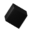
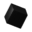
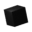

# wincursorgen

[](https://github.com/poormark/wincursorgen/actions/workflows/rust.yml)

A program to convert series of PNGs into CUR cursor files (`.cur`). For more explanation see [what](#what), [why](#why) and [does it work](#does-it-work). Make sure to check [wcursorgen](https://github.com/balthild/wcursorgen) as well, it's a program totally the same as mine, except for one detail, it isn't immediately compatible with existing makefiles and scripts, because its' CLI interface is different from xcursorgen.

## Testing

I don't use any special framework.

1. Build it or check whether this commit succeeds in CI.
2. Try creating a cursor using 
	```shell
	./targets/release/wincursorgen -p ./tests/images/ ./tests/test-cursor.in ./test-cursor
	```
3. Try creating an animated cursor using 
	```shell
	./targets/release/wincursorgen -p ./tests/images/ ./tests/animated-test-cursor.in ./animated-test-cursor
	```

Check cursors on windows. If everything is output as expected, this program works.

### Cursor images for testing
Created by me, anyone can use them.

- Static: 
- Animated: 

## What?

In Linux world there's a utility called `xcursorgen`. It is used to *"create an X cursor file from a collection of PNG images"* or just to create cursors from PNGs basically.

This program - `wincursorgen` - is meant to act as twin of `xcursorgen` for Windows CUR files, to *"create a Windows cursor file from a collection of PNG images"*, that is.

## Why?

I've found this one cursor for Linux that I desperately want to port to Windows, but I also don't want to impact the workflow of the author or writing a python script. Since this is just a pure desire of mine, It doesn't bother me if I spend a week or a month writing this software. I just hope that it will be useful.

Therefore I imagine it fitting nicely into already existing automation scripts and makefiles that cursor makers use. Instead of completely rewriting their scripts, they can just duplicate a make target and replace `xcursorgen` with `wincursorgen` and get the same output, but for Windows.

## Does it work?

Every stable release is tested to work, but if you find a bug, open an issue.

## Credits

Actually, thx to `xcursorgen` for creating this awesome "cursor specification" kinda files. Makes creating cursors a fun automation task.
